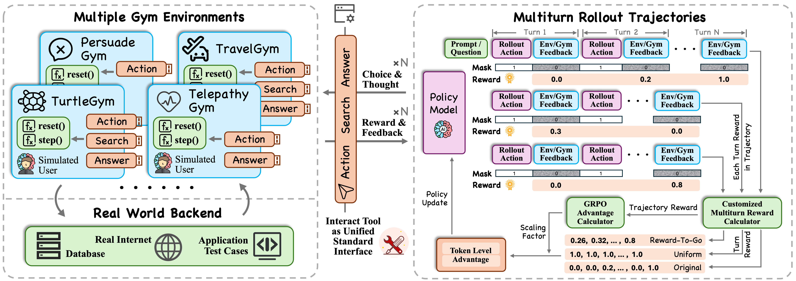

<p align="center">
  
</p>

# UserRL: Training Proactive User-Centric Agent via Reinforcement Learning
| [**📖 Paper**](https://arxiv.org/pdf/2509.19736) | [**📊 Dataset**](https://github.com/SalesforceAIResearch/UserRL/tree/main/data) |

This is the official repository for paper "UserRL: Training Proactive User-Centric Agent via Reinforcement Learning".

This project is a focused TravelGym implementation of UserRL. It trains LLMs
with Group Relative Policy Optimization (GRPO) on long-horizon travel planning
dialogues and the public Search -> Action -> Answer interaction contract.



## 🎯 Overview

UserRL enables training language models to interact effectively with users across multiple domains through:

- **Multi-Turn Conversations**: Support for complex, extended dialogues with proper credit assignment
- **TravelGym Environment**: Multi-aspect travel planning with hidden user preferences
- **Terminal Reward GRPO**: GRPO over the TravelGym terminal score; behavior-component TurnCredit is enabled by default
- **Scalable Training**: Multi-GPU support with SGLang backend for efficient inference
- **End-to-End Evaluation**: Terminal-only TravelGym scoring and protocol diagnostics

## 🏗️ Architecture

### Core Components

```
UserRL/
├── gyms/              # TravelGym environment
├── verl/              # Core RL training framework
├── examples/          # Training configurations and data preprocessing
├── sft/               # Supervised fine-tuning pipeline
├── eval/              # Comprehensive evaluation framework
└── data/              # Training and validation datasets
```

### Key Features

- **🤖 TravelGym Training**: Train on multi-aspect travel recommendation tasks
- **🎯 TurnCredit**: Conservation-checked redistribution after terminal GRPO advantages; enabled by default
- **⚡ Efficient Inference**: SGLang backend with optimized memory utilization
- **📊 Comprehensive Logging**: SwanLab tracks final Reward and every public Reward component
- **🔧 Flexible Configuration**: Hydra-based configuration system for easy experimentation

## 🚀 Quick Start

### Prerequisites

- Python 3.12
- CUDA-compatible GPU(s)
- OpenAI API key (for user simulation)

### Installation

1. **Create Environment**
   ```bash
   conda create -n userrl python=3.12
   conda activate userrl
   ```

2. **Install UserRL**
   ```bash
   pip install -e .[sglang]
   pip install flash-attn --no-build-isolation
   ```

3. **Install TravelGym**
   ```bash
   bash install_gyms.sh
   ```

### Basic Training

1. **Configure Environment Variables**
   ```bash
   cp .env.example .env
   # Edit .env: set OPENAI_API_KEY (or DEEPSEEK_API_KEY),
   # OPENAI_BASE_URL, and USER_MODEL_NAME.
   ```

   `eval.py`, TravelGym, and the SGLang launcher load API settings from the
   repository-root `.env`. The file is git-ignored; keep real keys out of the
   repository.

2. **Set the Actor checkpoint and GPU selection**
   
   The launcher derives the project path from its own location and defaults to
   `Qwen/Qwen3.5-4B`. Set `ACTOR_MODEL_PATH` only when using a local/downloaded
   checkpoint, and override the default single-GPU setting when needed:
   ```bash
   export ACTOR_MODEL_PATH=/path/to/your/model
   export CUDA_VISIBLE_DEVICES=0
   # export N_GPUS_PER_NODE=1  # defaults to the number of visible IDs
   ```

3. **Start Training**
   ```bash
   bash ./examples/sglang_multiturn/train.sh
   ```

## 🎮 TravelGym Dataset Variants

The active training environment is TravelGym. Dataset variants encode the
number and combination of travel aspects (flight, hotel, apartment, rental
car, and restaurant):

| Variant | Dataset |
|---------|---------|
| `travel22`, `travel33`, `travel44` | Two-aspect tasks |
| `travel233`, `travel333`, `travel334`, `travel444`, `travel2222` | Longer multi-aspect tasks |

TravelGym provides Search, natural-language Action evidence, and Answer calls;
Search returns the complete candidate list and Action never shrinks it.

## 🏋️ Training Pipeline

### 1. Supervised Fine-Tuning (Optional)

For improved initialization, first convert/merge the canonical trajectories.  The
original 244-record file is never overwritten.  The task-pool manifest reserves
600 resolved train tasks for SFT (238 historical plus 362 Teacher-expansion
tasks); six historical rows with unresolved task IDs are quarantined:

```powershell
python .\sft\task_pools.py --sft-target-count 600 --output .\data\task_pools\travel_task_pools.json
# The six opaque historical rows are permanently isolated/discarded; no
# reviewed task map is needed for the formal active-pool manifest.
python .\eval\eval.py --model_name deepseek-v4-flash --sft-collection `
  --thinking enabled --include-think --require-think `
  --task-pool-manifest .\data\task_pools\travel_task_pools.json `
  --task-pool sft `
  --max_turns 25 --save_name outputs/deepseek_teacher_sft
python .\sft\merge_travel_sft.py `
  --base .\sft\travel_sft_public.json `
  --input .\eval\outputs\deepseek_teacher_sft_teacher_cache.json `
  --output .\sft\travel_sft_canonical.jsonl `
  --tokenizer Qwen/Qwen3.5-4B --max-length 32768 `
  --split-output-dir .\sft `
  --task-pool-manifest .\data\task_pools\travel_task_pools.json
```

Then run the authoritative VERL LoRA config
`verl/trainer/config/travel_qwen35_sft.yaml`.  Each complete trajectory is one
sample; `assistant_train_mask` supervises only valid Assistant turns (including
their CoT and tool call), and partial-correct rows carry weight 0.5.  See
[sft/README.md](sft/README.md) for task-pool expansion, audit and validation details.

```bash
torchrun --standalone --nproc_per_node=1 -m verl.trainer.fsdp_sft_trainer \
  --config-name=travel_qwen35_sft \
  trainer.n_gpus_per_node=1 \
  model.partial_pretrain=Qwen/Qwen3.5-4B
```

### 2. Reinforcement Learning Training

**Key Training Parameters:**

- **Algorithm**: GRPO with terminal-only TravelGym reward
- **Turn-Level Credit**: behavior-component attribution runs in `train` by default; set `algorithm.turn_credit.stage=off` to disable it
- **Trajectory Scoring**: terminal scalar (no per-step reward averaging)
- **Dynamic Resampling**: bounded dynamic resampling enabled by default; numerical equality uses `1e-6`, while the minimum meaningful terminal-reward spread is `0.005`; the Hard Case Pool remains audit-only
- **Hard Case Pool**: trainer-private, append-only audit of three consecutive valid all-zero rollout groups; no resampling or training injection

**Training Configuration Example:**

```yaml
# Key hyperparameters in train.sh
algorithm.adv_estimator: grpo_multiturn
algorithm.gamma: 0.8
algorithm.dynamic_sampling.enable: true
data.train_batch_size: 4
actor_rollout_ref.actor.ppo_mini_batch_size: 2
actor_rollout_ref.actor.optim.lr: 1e-5
actor_rollout_ref.actor.clip_ratio_low: 0.15
actor_rollout_ref.actor.clip_ratio_high: 0.25
actor_rollout_ref.rollout.n: 4
actor_rollout_ref.rollout.multi_turn.max_turns: 25
actor_rollout_ref.rollout.multi_turn.turn_level_method: "component_attribution"
actor_rollout_ref.rollout.multi_turn.trajectory_score_method: "Terminal"
algorithm.turn_credit.stage: train
actor_rollout_ref.model.lora_rank: 32
actor_rollout_ref.model.lora_alpha: 64
OMP_NUM_THREADS: 8
trainer.save_freq: 20
trainer.total_training_steps: 100
trainer.milestones: [20, 40, 60, 80, 100]
```

### 3. Model Evaluation

Evaluation across the TravelGym dataset variants:

```bash
# See detailed instructions in eval/README.md
cd eval/
# Follow evaluation pipeline
```

The evaluator uses the fixed `eval/test_manifests/final200.json` set by
default (the 20-task `smoke20.json` set is available for quick checks), rather
than running all 471 composition-test tasks.  Task-level disjointness between
SFT, GRPO, and Validation is enforced by
`data/task_pools/travel_task_pools.json`.

## 📊 Advanced Configuration

### Multi-GPU Training

TravelGym training can use one or more GPUs:

```bash
# Configure GPU usage
export CUDA_VISIBLE_DEVICES=0,1,2,3,4,5,6,7
export N_GPUS_PER_NODE=8
# The launcher passes trainer.nnodes=1 and derives the data/config paths.
bash ./examples/sglang_multiturn/train.sh
```

### User Simulation Options

**Option 1: OpenAI GPT-4o**
```bash
# Set in .env:
# OPENAI_BASE_URL=https://api.openai.com/v1
# USER_MODEL_NAME=gpt-4o
```

**Option 2: Local Model**
```bash
# We apply Qwen3-32B as simulated user in paper's experiments
# Set in .env:
# OPENAI_BASE_URL=http://localhost:8000/v1
# USER_MODEL_NAME=Qwen/Qwen3-32B
```

### Memory Optimization

For large models, configure memory settings:

```yaml
actor_rollout_ref.model.enable_gradient_checkpointing: True
actor_rollout_ref.model.enable_activation_offload: True
actor_rollout_ref.rollout.gpu_memory_utilization: 0.40
```

## 🔧 Extending TravelGym

TravelGym-specific changes must preserve the public contract documented in
`docs/travel_public_protocol.md`. Regenerate numbered TravelGym parquet files
with `examples/data_preprocess/travel_multiturn_w_tool.py`, merge the active
variants with `examples/data_preprocess/merge_customize.py`, and update the
offline contract tests before training.

## 📈 Monitoring and Logging

UserRL provides comprehensive logging through:

- **Console Output**: Real-time training progress
- **SwanLab**: Detailed metrics, validation generations, and visualization
- **Checkpointing**: Automatic model saving and best model selection

```yaml
trainer.logger: ['console', 'swanlab']
trainer.project_name: 'TravelGym'
trainer.save_freq: 20
trainer.test_freq: 5
```

SwanLab is the default monitoring backend for the TravelGym launchers. Set
`SWANLAB_API_KEY` in the repository `.env` for online cloud syncing; use
`SWANLAB_MODE=local` or `offline` when the training server has no network.
Each step logs `grpo/*/reward/final` and the public terminal-reward components
under `grpo/*/reward/components/*`. The launchers also arm
`scripts/grpo_shutdown_watcher.py` by default; live logs are under the run's
`training.log` and `monitor/`, and `GRPO_AUTO_SHUTDOWN=0` disables poweroff for
a deliberate manual run. `TRAINER_LOGGER=wandb` remains available as an
explicit compatibility override.

## 🤝 Contributing

We welcome contributions! Please see individual component READMEs:

- [Gym Environments](gyms/README.md)
- [SFT Pipeline](sft/README.md)  
- [Evaluation Framework](eval/README.md)
- [TravelGym Training Chain](docs/travel_training_chain.md)

## 📝 Citation

```bibtex
@article{qian2025userrl,
  title={UserRL: Training Interactive User-Centric Agent via Reinforcement Learning},
  author={Qian, Cheng and Liu, Zuxin and Prabhakar, Akshara and Qiu, Jielin and Liu, Zhiwei and Chen, Haolin and Kokane, Shirley and Ji, Heng and Yao, Weiran and Heinecke, Shelby and Savarese, Silvio and Xiong, Caiming and Wang, Huan},
  journal={arXiv preprint arXiv:2509.19736},
  year={2025}
}
```

## 🙏 Acknowledgments

Built on top of:
- [VERL](https://github.com/volcengine/verl) - Volcano Engine Reinforcement Learning framework
- [SGLang](https://github.com/sgl-project/sglang) - Efficient LLM serving

---

For detailed documentation on specific components, please refer to the respective README files in each subdirectory.
